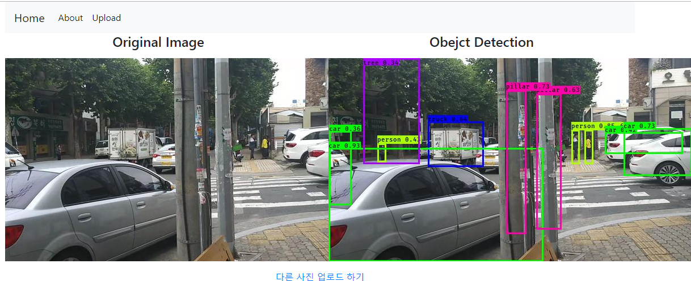

# Yolov3 with Keras 정리 및 파일내용.

## 데이터셋 라벨링

- 데이터셋 확보 방법
    - 인근 지역을 도보로 걸어다니며 찍은 촬영영상 일정 프레임 단위로 쪼개어 이미지 확보
    - 인터넷의 도로영상 또는 신호등 사진 등 사용.
- 데이터 라벨 종류
    - 사람(보행자), 차량, 나무(가로수), 기둥(전봇대등), 신호등, 표지판 , 작업조원의 얼굴 등 9종
- 사용된 프로그램
    - Labelimg 의 프로그램 [링크](https://github.com/tzutalin/labelImg)

## xml_make.py

- labeling 된 데이터를 사용하여 train.txt 의 규칙에 맞게 생성.
    `이미지파일경로 x1,y1,x2,y2,class`
    `이미지파일경로 x1,y1,x2,y2,class x1,y1,x2,y2,class`
    하나의 사진에 여러개의 라벨링이 존재하므로, 하나의 사진에서 여러개의 class 존재.

- voc_accnotation.py 를 참조하여 작성 하였음.
- 코드상에서 중복된 라벨을 하나로 취급할수 있는 처리도 가능함.

## train.py

- 학습데이터 파일을 이용해 학습
- 학습시킬 H/W 의 성능에 따라 batchsize 를 조정. (RAM 에 따라 조정.)
- 학습시에는 Google Cloud Platform 의 GPU 를 사용하여 트레이닝.

## yolo_detect.py

- Yolo 객체 및 이미지 검출 객체
- Yolo 객체 생성시, 직접 학습시킨 classes 및 md5 (weight) 를 사용하는 파라매터 사용.

## flask 연동

- 사진을 업로드하여 저장하고, 검출 결과를 보여주는 웹페이지
- 업로드 직후 욜로검출이 동작하며, CPU 에서 작업시 약 3~4초 정도 걸림.

## 샘플 이미지

## 사용한 라이브러리

- python 3.7.3
- keras 2.3.1
- tensorflow 1.14.0
- flask 2.2.6
- [Yolo v3 Keras 구현체](https://github.com/qqwweee/keras-yolo3)

## 기타 
- 작업 PC 사양 : I7-6700@3.4GHz, 8GB RAM

